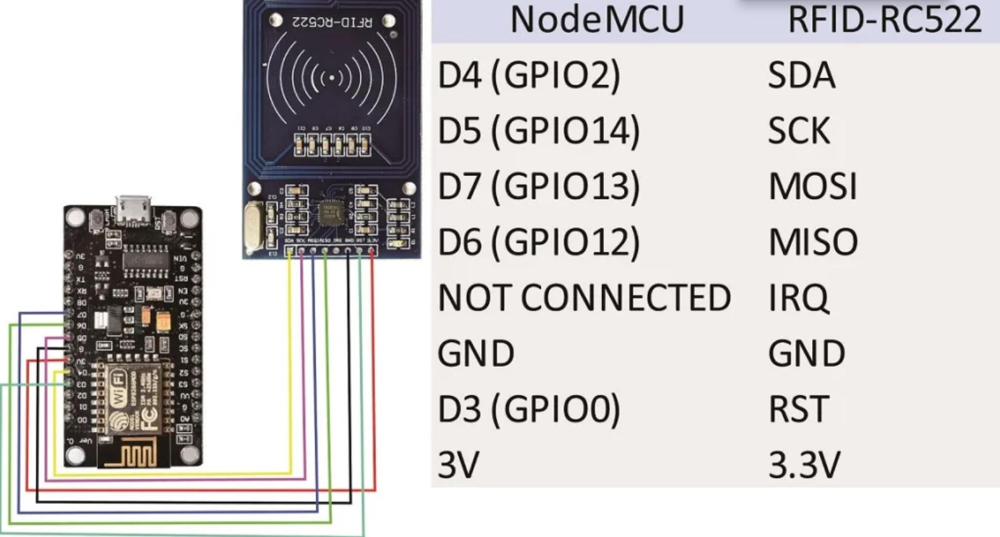

# Módulo RFID MFRC522 ao ESP8266

Este repositório contém um guia passo a passo sobre como conectar e utilizar o módulo RFID MFRC522 com o microcontrolador ESP8266. O RFID MFRC522 é um leitor/gravador de RFID amplamente utilizado para projetos de controle de acesso, sistemas de autenticação e muito mais. O ESP8266 é um microcontrolador Wi-Fi popular que é frequentemente utilizado em projetos IoT.

Neste guia, você encontrará informações detalhadas sobre como configurar o hardware, conectar os pinos do módulo RFID MFRC522 ao ESP8266 e programar o microcontrolador para interagir com o módulo RFID. Também incluímos exemplos de código para ajudá-lo a começar com seus próprios projetos.

### Esquema de ligação dos Pinos 


```cpp
#include <SPI.h>
#include <MFRC522.h>
constexpr uint8_t RST_PIN = D3;     // Configurable, see typical pin layout above
constexpr uint8_t SS_PIN = D4;     // Configurable, see typical pin layout above
MFRC522 rfid(SS_PIN, RST_PIN); // Instance of the class
MFRC522::MIFARE_Key key;
String tag;
void setup() {
  Serial.begin(9600);
  SPI.begin(); // Init SPI bus
  rfid.PCD_Init(); // Init MFRC522
  pinMode(D8, OUTPUT);
}
void loop() {
  if ( ! rfid.PICC_IsNewCardPresent())
    return;
  if (rfid.PICC_ReadCardSerial()) {
    for (byte i = 0; i < 4; i++) {
      tag += rfid.uid.uidByte[i];
    }
    Serial.println(tag);
    if (tag == "1193818595") {
      Serial.println("Access Granted!");
      digitalWrite(D8, HIGH);
      delay(100);
      digitalWrite(D8, LOW);
      delay(100);
      digitalWrite(D8, HIGH);
      delay(100);
      digitalWrite(D8, LOW);
      delay(100);
      digitalWrite(D8, HIGH);
      delay(100);
      digitalWrite(D8, LOW);
      delay(100);
    } else {
      Serial.println("Access Denied!");
      digitalWrite(D8, HIGH);
      delay(2000);
      digitalWrite(D8, LOW);
    }
    tag = "";
    rfid.PICC_HaltA();
    rfid.PCD_StopCrypto1();
  }
}
```
